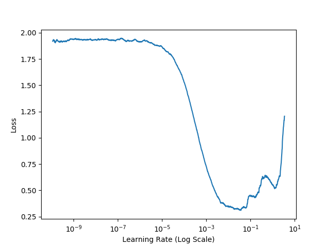
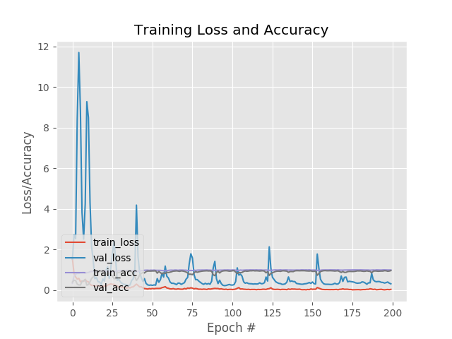

According to Leslie Smith’s 2017 paper, "Cyclical Learning Rates for Training Neural Networks", this project try to find the optimal learning rate and then train the dataset using that learning rate. Cyclical Learning Rates (triangular2) is also used.
To run the code execute this commands:
- python train.py --lr-find 1 --d images 

This command will find the learning rate and plot valus in a plot. plot may look like this.

From the graph, loss started to decrease after 0.00001 and started to increase after 0.055.
So
- max larning rate = 0.055
- min learning rate = 0.00001

Using this learning rate, i trained the model with 200 epochs using Cyclical Learning Rates (triangular2).
To train the model execute this command:
- python train.py --d images

After training, here is the learning curve.

Also model evaluation:
<pre>
[INFO] evaluating network...
              precision    recall  f1-score   support

   bulbasaur       0.97      0.95      0.96        40
  charmander       0.98      0.94      0.96        54
      mewtwo       1.00      0.98      0.99        45
     pikachu       0.95      0.95      0.95        44
    squirtle       0.88      0.97      0.93        39

    accuracy                           0.96       222
   macro avg       0.96      0.96      0.96       222
weighted avg       0.96      0.96      0.96       222
</pre>
